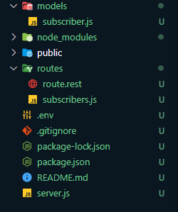

# Getting started with Express and MongoDB

Basic usage of Express and MongoDB to create a simple REST API. [Express](https://expressjs.com/) is a minimal and flexible Node.js web application framework that provides a robust set of features for web and mobile applications. [MongoDB](https://www.mongodb.com/) is a source-available cross-platform document-oriented database program. Classified as a NoSQL database program, MongoDB uses JSON-like documents with optional schemas.

## Installation

1. Clone the repository

```bash
git clone
```

2. Install dependencies

```bash
npm install
```

3. Run the server

```bash
npm run dev
```

4. Edit HTTP request in `route/route.rest` (Alternatively, you can use other tools like curl & postman)

## File Structure

_bigger project might have different file structures_

<div style="text-align:center">
    
</div>

1. `models/` - data models & schemas
2. `routes/` - API routes **or** Endpoints **or** Resources
3. `server.js` - file that starts your web server
